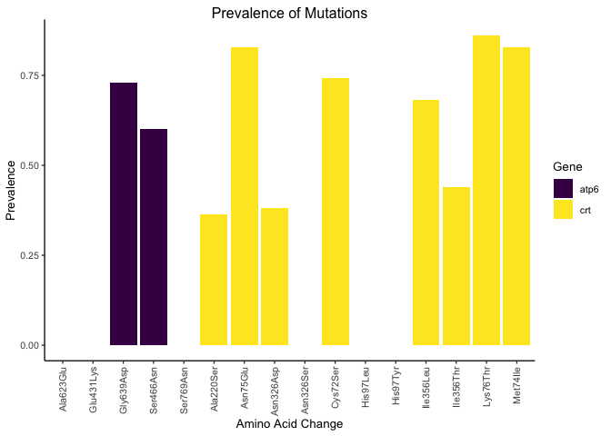

<!-- README.md is generated from README.Rmd. Please edit that file -->

# miplicorn <a href='https://bailey-lab.github.io/miplicorn/'></a>

<!-- badges: start -->

[](https://github.com/bailey-lab/miplicorn/actions/workflows/check-standard.yaml)
[](https://app.codecov.io/gh/bailey-lab/miplicorn?branch=main)
[](https://lifecycle.r-lib.org/articles/stages.html#experimental)
[](https://opensource.org/licenses/MIT)

<!-- badges: end -->

miplicorn establishes a unified analysis framework in R for molecular
inversion probe (MIP) and amplicon-targeted sequencing analysis after
micro haplotyping or variant calling. It provides tools for parsing
large variant files, filtering and manipulating the data, and basic
analyses and visualization.

## Installation

You may install the package from
[Github](https://github.com/bailey-lab/miplicorn) using `devtools`.

<div class=".pkgdown-release">

```r
# Install most recent released version
devtools::install_github("bailey-lab/miplicorn@v0.2.1")
```

</div>

<div class=".pkgdown-devel">

```r
# Install development version
devtools::install_github("bailey-lab/miplicorn")
```

</div>

## Usage

See `vignette("miplicorn")` for a more extensive introduction and a
demonstration of several features of the package.

```r
library(miplicorn)

ref_file <- miplicorn_example("reference_AA_table.csv")
alt_file <- miplicorn_example("alternate_AA_table.csv")
cov_file <- miplicorn_example("coverage_AA_table.csv")

data <- read_tbl_ref_alt_cov(ref_file, alt_file, cov_file, gene == "atp6" | gene == "crt")
data
#> # A ref alt cov table: 832 × 10
#>   sample   gene_id gene  mutat…¹ exoni…² aa_ch…³ targe…⁴ ref_u…⁵ alt_u…⁶ cover…⁷
#>   <chr>    <chr>   <chr> <chr>   <chr>   <chr>   <chr>     <dbl>   <dbl>   <dbl>
#> 1 D10-JJJ… PF3D7_… atp6  atp6-A… missen… Ala623… Yes         608       0     608
#> 2 D10-JJJ… PF3D7_… atp6  atp6-A… missen… Ala623… Yes          20       0      20
#> 3 D10-JJJ… PF3D7_… atp6  atp6-A… missen… Ala623… Yes         158       0     158
#> 4 D10-JJJ… PF3D7_… atp6  atp6-A… missen… Ala623… Yes           2       0       2
#> 5 D10-JJJ… PF3D7_… atp6  atp6-A… missen… Ala623… Yes           1       0       1
#> # … with 827 more rows, and abbreviated variable names ¹​mutation_name,
#> #   ²​exonic_func, ³​aa_change, ⁴​targeted, ⁵​ref_umi_count, ⁶​alt_umi_count,
#> #   ⁷​coverage

plot_coverage(data, mutation_name)
```


```r

prev <- mutation_prevalence(data, threshold = 5)
prev
#> # A tibble: 16 × 4
#>   mutation_name  n_total n_mutant prevalence
#>   <chr>            <int>    <int>      <dbl>
#> 1 atp6-Ala623Glu      36        0      0
#> 2 atp6-Glu431Lys      39        0      0
#> 3 atp6-Gly639Asp      26       19      0.731
#> 4 atp6-Ser466Asn      15        9      0.6
#> 5 atp6-Ser769Asn      17        0      0
#> # … with 11 more rows

plot(prev)
```


