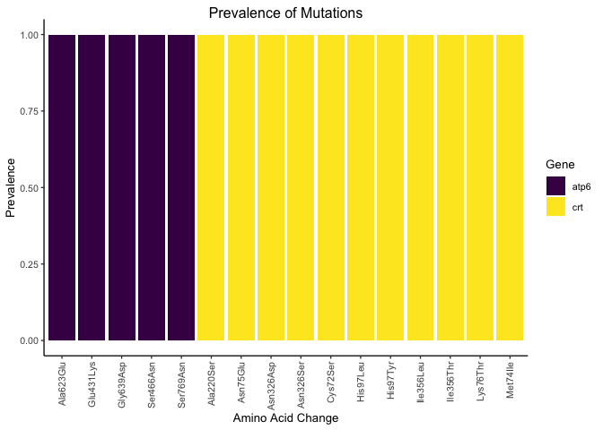

<!-- README.md is generated from README.Rmd. Please edit that file -->

# miplicorn <a href='https://bailey-lab.github.io/miplicorn/'></a>

<!-- badges: start -->

[](https://github.com/bailey-lab/miplicorn/actions/workflows/check-standard.yaml)
[](https://app.codecov.io/gh/bailey-lab/miplicorn?branch=main)
[](https://lifecycle.r-lib.org/articles/stages.html#experimental)
[](https://opensource.org/licenses/MIT)

<!-- badges: end -->

miplicorn establishes a unified framework for molecular inversion probe
(MIP) and amplicon analysis. It provides the tools to quickly parse
files several gigabytes large, filter and manipulate data, analyze data,
and, most informatively, visualize data.

## Installation

You may install the package from
[Github](https://github.com/bailey-lab/miplicorn) using `devtools`.

<div class=".pkgdown-release">

```r
# Install most recent released version
devtools::install_github("bailey-lab/miplicorn@v0.2.1")
```

</div>

<div class=".pkgdown-devel">

```r
# Install development version
devtools::install_github("bailey-lab/miplicorn")
```

</div>

## Usage

See `vignette("miplicorn")` for a more extensive introduction and a
demonstration of several features of the package.

```r
library(miplicorn)

ref_file <- miplicorn_example("reference_AA_table.csv")
alt_file <- miplicorn_example("reference_AA_table.csv")
cov_file <- miplicorn_example("reference_AA_table.csv")

data <- read_tbl_ref_alt_cov(ref_file, alt_file, cov_file, gene == "atp6" | gene == "crt")
data
#> # A tibble: 832 × 10
#>   sample     gene_id       gene  mutation_name  exonic_func   aa_change targeted
#>   <chr>      <chr>         <chr> <chr>          <chr>         <chr>     <chr>
#> 1 D10-JJJ-23 PF3D7_0106300 atp6  atp6-Ala623Glu missense_var… Ala623Glu Yes
#> 2 D10-JJJ-43 PF3D7_0106300 atp6  atp6-Ala623Glu missense_var… Ala623Glu Yes
#> 3 D10-JJJ-55 PF3D7_0106300 atp6  atp6-Ala623Glu missense_var… Ala623Glu Yes
#> 4 D10-JJJ-5  PF3D7_0106300 atp6  atp6-Ala623Glu missense_var… Ala623Glu Yes
#> 5 D10-JJJ-47 PF3D7_0106300 atp6  atp6-Ala623Glu missense_var… Ala623Glu Yes
#> # … with 827 more rows, and 3 more variables: ref_umi_count <dbl>,
#> #   alt_umi_count <dbl>, coverage <dbl>

filter_coverage(data, 100)
#> # A tibble: 236 × 10
#>   sample     gene_id       gene  mutation_name  exonic_func   aa_change targeted
#>   <chr>      <chr>         <chr> <chr>          <chr>         <chr>     <chr>
#> 1 D10-JJJ-23 PF3D7_0106300 atp6  atp6-Ala623Glu missense_var… Ala623Glu Yes
#> 2 D10-JJJ-55 PF3D7_0106300 atp6  atp6-Ala623Glu missense_var… Ala623Glu Yes
#> 3 D10-JJJ-15 PF3D7_0106300 atp6  atp6-Ala623Glu missense_var… Ala623Glu Yes
#> 4 D10-JJJ-52 PF3D7_0106300 atp6  atp6-Ala623Glu missense_var… Ala623Glu Yes
#> 5 D10-JJJ-38 PF3D7_0106300 atp6  atp6-Ala623Glu missense_var… Ala623Glu Yes
#> # … with 231 more rows, and 3 more variables: ref_umi_count <dbl>,
#> #   alt_umi_count <dbl>, coverage <dbl>
filter_targeted(data, "Yes")
#> # A tibble: 624 × 10
#>   sample     gene_id       gene  mutation_name  exonic_func   aa_change targeted
#>   <chr>      <chr>         <chr> <chr>          <chr>         <chr>     <chr>
#> 1 D10-JJJ-23 PF3D7_0106300 atp6  atp6-Ala623Glu missense_var… Ala623Glu Yes
#> 2 D10-JJJ-43 PF3D7_0106300 atp6  atp6-Ala623Glu missense_var… Ala623Glu Yes
#> 3 D10-JJJ-55 PF3D7_0106300 atp6  atp6-Ala623Glu missense_var… Ala623Glu Yes
#> 4 D10-JJJ-5  PF3D7_0106300 atp6  atp6-Ala623Glu missense_var… Ala623Glu Yes
#> 5 D10-JJJ-47 PF3D7_0106300 atp6  atp6-Ala623Glu missense_var… Ala623Glu Yes
#> # … with 619 more rows, and 3 more variables: ref_umi_count <dbl>,
#> #   alt_umi_count <dbl>, coverage <dbl>

prev <- mutation_prevalence(data, threshold = 5)
prev
#> # A tibble: 16 × 4
#>   mutation_name  n_total n_mutant prevalence
#>   <chr>            <int>    <int>      <dbl>
#> 1 atp6-Ala623Glu      36       36          1
#> 2 atp6-Glu431Lys      39       39          1
#> 3 atp6-Gly639Asp      26       26          1
#> 4 atp6-Ser466Asn      15       15          1
#> 5 atp6-Ser769Asn      17       17          1
#> # … with 11 more rows

plot(prev)
```


